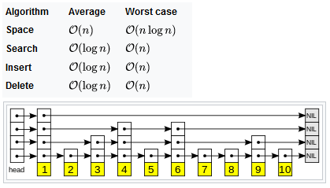

# Data Structures
 
## Contents
1. [Skip List](#skip-list)

## Skip List
- **skip_list.py** - Probabilistic data structure with the following attributes:
  
  
  
  https://en.wikipedia.org/wiki/Skip_list
  
